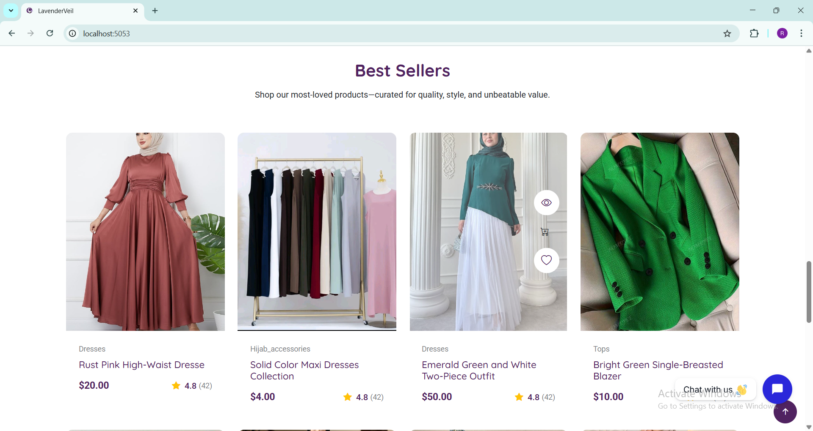
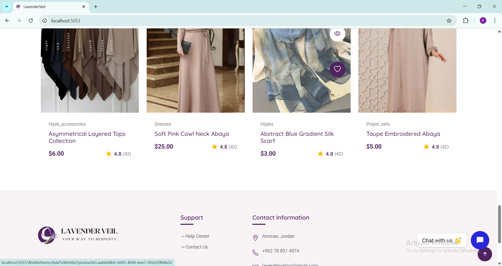
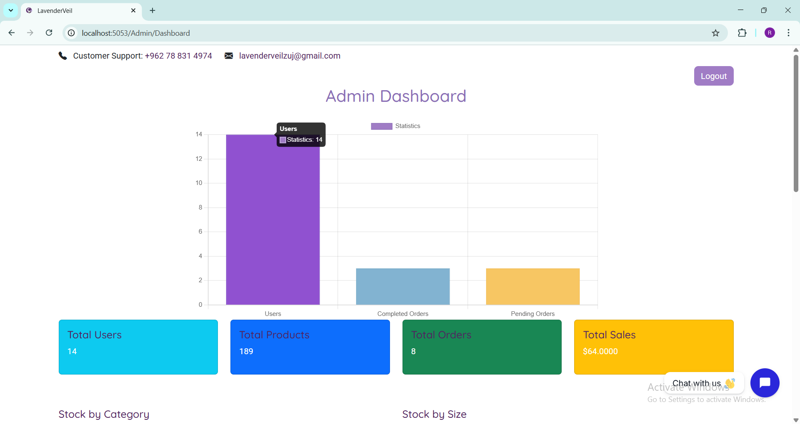
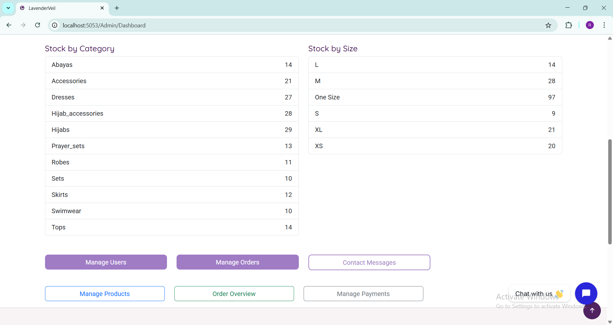
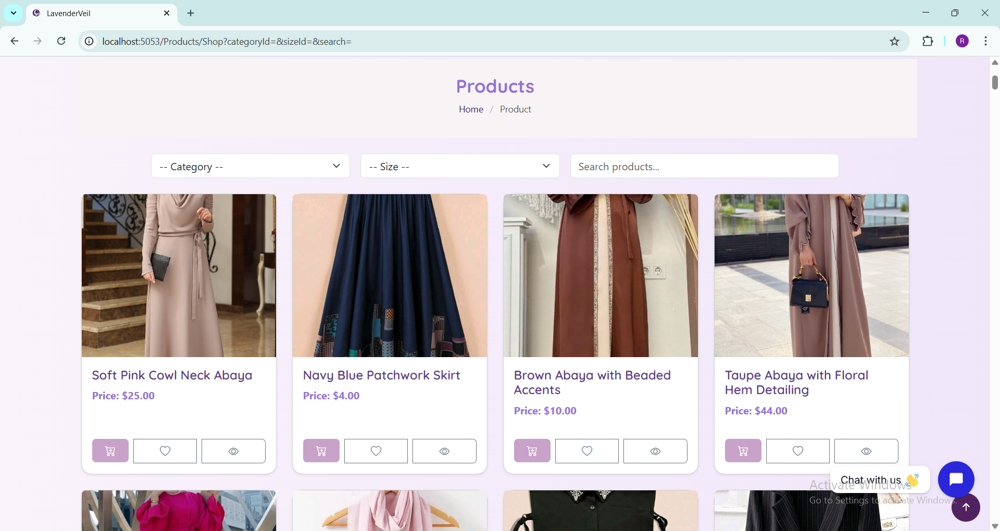
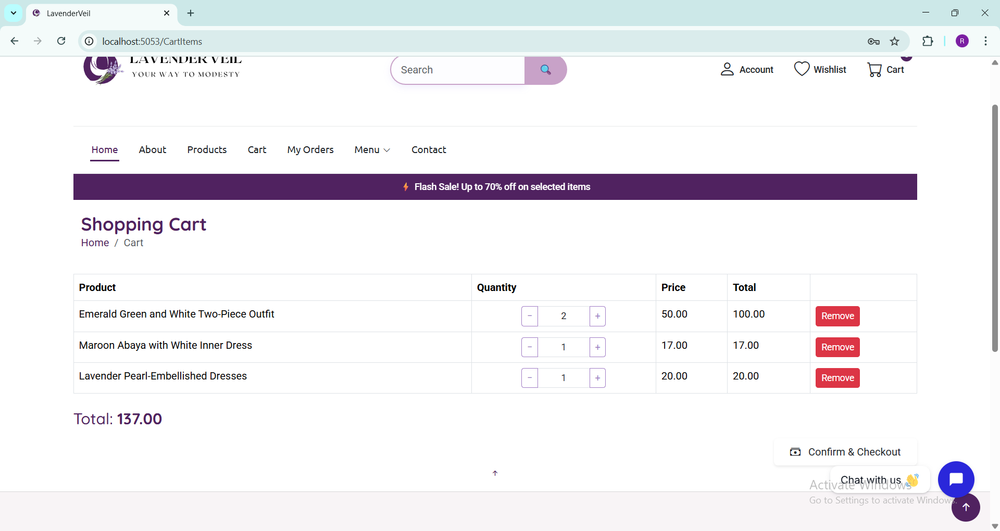
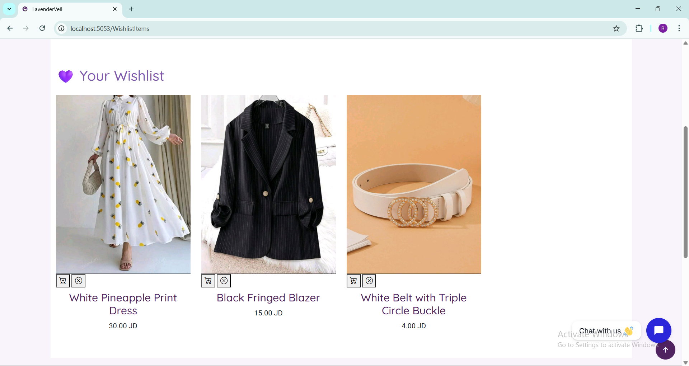

# 🌸 Lavender_Veil

**Graduation Project – Computer Science | 2025**  
An elegant e-commerce web application for modest clothing, built using ASP.NET Core MVC.

---

## 👩‍💻 About the Project

Lavender_Veil is an online clothing store focused on providing modest and elegant wear for women.  
The platform was built as part of our final year graduation project, showcasing full-stack web development using modern technologies.

---

## 🛠️ Tech Stack

- ASP.NET Core MVC 8.0  
- Entity Framework Core  
- SQL Server  
- Identity Framework (Authentication & Authorization)  
- Bootstrap 5  

---

## 👥 Team Members

This project was built with collaboration and passion by:

- **Raufa Sultan** – Back-End Developer  
- **Aya Afaneh** – Back-End Developer  
- **Hanan Othman** – Designer (Front-End)

---

## 📸 Screenshots

---

### 🏠 Home Page

#### 🔼 Top Section


#### 🔽 Middle Section


#### 🔚 Bottom Section


---

### 🛠️ Admin Dashboard

#### 📊 Dashboard Overview





---

### 🛍️ Products Page


---

### 🛒 Shopping Cart


---

### 💜 Wishlist



## 🚀 Features

- Public product browsing without login  
- User registration and login with password strength validation  
- Shopping cart and wishlist  
- Checkout process with order confirmation  
- Admin panel for managing products, orders, and stock  
- Responsive and modern lavender-themed design  

---

## 🧰 How to Run the Project

1. Clone the repository:
   ```bash
   git clone https://github.com/your-username/Lavender_Veil.git
Open the project in Visual Studio 2022+

Update your database:


dotnet ef database update

Run the project using IIS Express or Kestrel


📄 License
This project is part of a university graduation requirement and is intended for educational purposes only.

✨ Built with dedication, teamwork, and lavender spirit!
